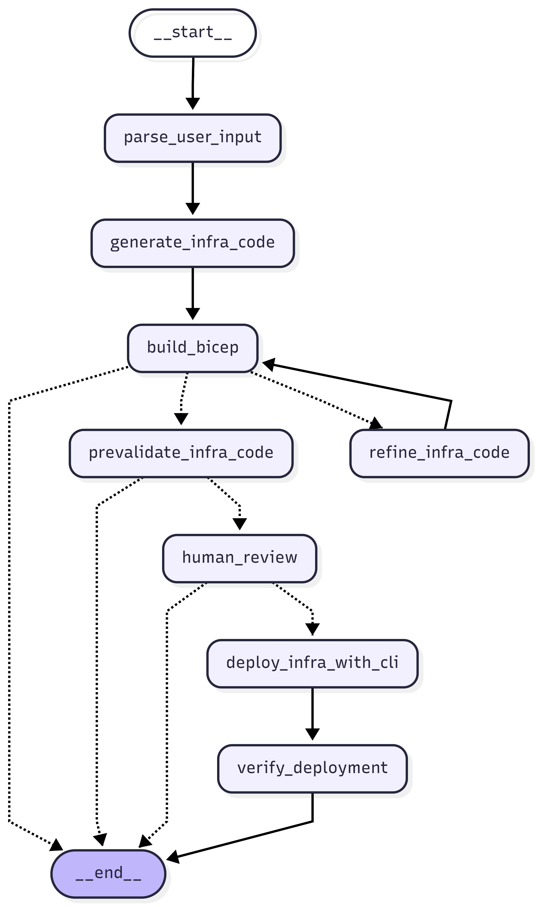

# Azure Infrastructure Deployment Agent

An AI-powered agent built with **LangGraph** that converts natural language requests into Azure infrastructure deployments. The agent parses user prompts, generates **Bicep** templates, validates them, and deploys resources to Azure — all with a human-in-the-loop approval step.

## Overview

This notebook implements a multi-step agentic workflow:

1. **Parse User Input** — An LLM (Azure OpenAI) extracts structured deployment parameters from a natural language prompt using Pydantic models.
2. **Generate Bicep Code** — The LLM generates a syntactically correct Bicep template based on the parsed parameters.
3. **Build & Validate** — The generated Bicep is compiled (`az bicep build`) and pre-validated (`az deployment group validate`) against Azure.
4. **Refine (if needed)** — If the build fails, the LLM automatically refines the Bicep code and retries.
5. **Human Review** — The workflow pauses via a LangGraph `interrupt`, allowing you to review and approve/reject the generated code.
6. **Deploy** — On approval, the agent deploys the Bicep template using `az deployment group create`.
7. **Verify** — Post-deployment verification confirms the provisioning state.

### Workflow Graph



### Supported Azure Resources

| Resource Type | Example Prompt |
|---|---|
| **Storage Account** | *"Create a storage account named mysa123 in rg-aidemo in East US with standard LRS"* |
| **Key Vault** | *"Create a key vault named kv-demo-01 in rg-aidemo in West Europe with soft delete enabled"* |
| **App Service Plan** | *"Create an App Service Plan named asp-demo in rg-aidemo in East US with B1 tier"* |
| **Application Insights** | *"Create an application insights resource named ai-demo in rg-aidemo in East US"* |
| **Function App** | *"Create a function app named func-demo in rg-aidemo in East US with consumption plan and managed identity"* |

## Prerequisites

- **Python 3.10+**
- **Azure CLI** installed and authenticated (`az login`)
- **Azure Bicep CLI** (bundled with Azure CLI, or install separately)
- An **Azure OpenAI** endpoint with a deployed model
- An active **Azure subscription** with permissions to create resources

### Python Dependencies

```
langchain-openai
langgraph
pydantic
python-dotenv
gradio
ipython
```

Install all dependencies:

```bash
pip install langchain-openai langgraph pydantic python-dotenv gradio ipython
```

## Configuration

1. Create a `.env` file in the project directory with your Azure OpenAI credentials:

   ```
   AZURE_OPENAI_ENDPOINT=https://<your-endpoint>.openai.azure.com/
   AZURE_OPENAI_API_KEY=<your-api-key>
   ```

2. Ensure you are logged in to Azure CLI:

   ```bash
   az login
   ```

3. Verify Bicep is available:

   ```bash
   az bicep version
   ```

## How to Execute

### Option 1: Run Interactively in Jupyter

1. Open `L7_AutomateCloudDeployment.ipynb` in VS Code or Jupyter.
2. Run the cells **sequentially from top to bottom** (Cells 1–17 set up the agent).
3. In the invocation cell, edit the `user_input` string to describe the Azure resource you want to deploy.
4. Execute the invocation cell — the workflow will run and pause at the human review step.
5. Inspect the generated Bicep code in the output.
6. Run the approval cell with `"approved": True` to deploy, or `"approved": False` to reject.
7. Check the verification output for deployment status.

### Option 2: Use the Gradio Web UI

1. Run all cells through the final cell that launches `demo.launch()`.
2. A Gradio web interface will open in your browser.
3. Enter a natural language deployment request and click **Run Workflow**.
4. Review the generated Bicep code and workflow log.
5. Click **Approve & Deploy** or **Reject**.
6. Monitor the deployment log and status in the UI.

## Project Structure

```
azure_infra_deploy_agent/
├── L7_AutomateCloudDeployment.ipynb   # Main notebook with the LangGraph agent
├── README.md                          # This file
└── .env                               # Azure OpenAI credentials (not checked in)
```
